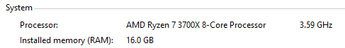
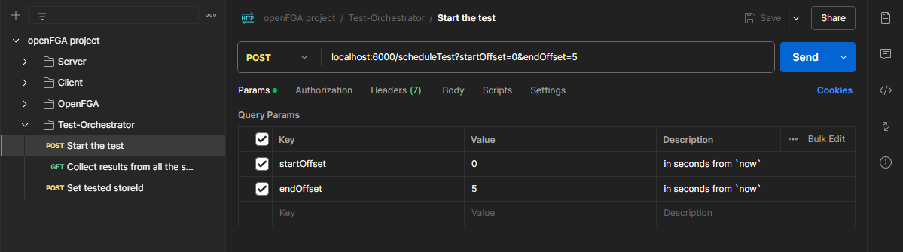
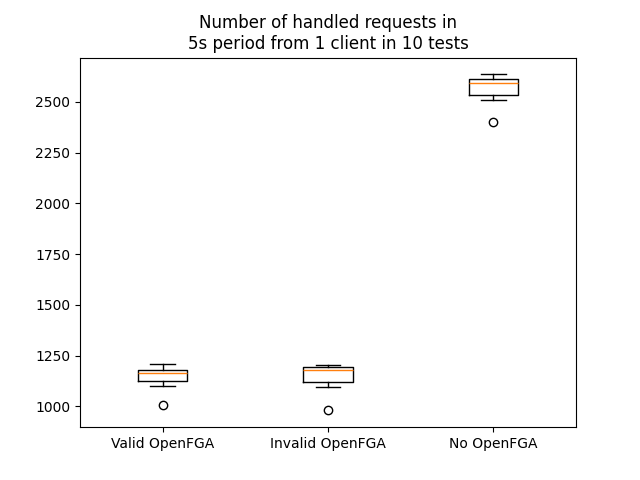
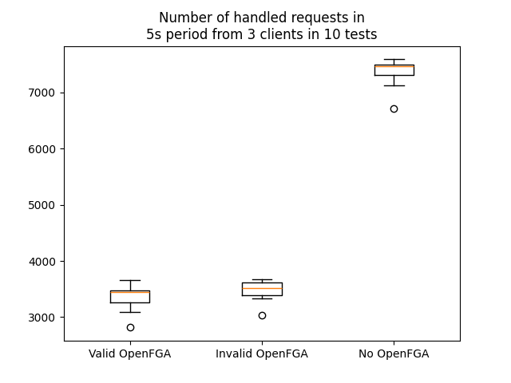
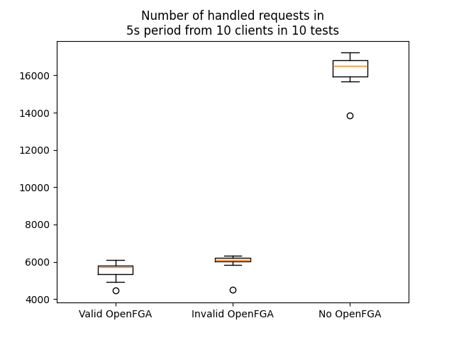

# OpenFGA_Demo
### Authors: Mateusz Asimowicz, Jakub Cichocki, Jan Prokop, Aleksander Pytel 
##### sem. zimowy 2024 | piątek 17:00 | grupa 3

---

## 1. Introduction
OpenFGA is an open-source relationship-based access control solution. We can specify relations between users/groups of users/objects and decide whether to grant or deny access to given resources, using APIs included for multiple programming languages.

## 2. Theoretical background/technology stack
OpenFGA is used to centralize authorization decisions and make the systems easier to audit, change and write, by decoupling it from the core service code - making the language-specific quirks of given authorization implementation irrelevant, since we operate that on the outside of the 'work' server domain. 
Upkeep of a single authorization point in the system architecture also makes it easier to pinpoint any potential issues, and the OpenFGA structure can be familiar to developers working on other projects later, as the core concepts behind it can be reused.
It also provides a system for an easy implementation (and possible changes) for a Relationship-Based Access Control (ReBAC) model, similar to the one that Google Zanzibar is known to use: existing relation between user (group) through action on a given resource means that the user is authorized to undertake given action, for example, this link existing:
owner - can_read - doc
authorizes the owner to read the doc resource.


For the technology stack, we will deploy OpenFGA and a test server, using an OpenFGA implementation in a chosen language - possibly Go, Python or JS - as well as an 'actor' that will try to request a resource, request a high amount of resources, or try to access resources despite the lack of access granted to them, in a technology that is yet to be determined. 

We will try to containerize given elements of the test system using Docker, as well as using Kubernetes to manage the running components of the test system.

## 3. Case study concept description

The main target of the study will be to assess how OpenFGA works under pressure and what is the overhead related to asking about the permission state when making API requests, mainly taking into consideration the response time on the server and to the client requesting the resource.

To this end, we will make measurements of the requests made/handled in a given timeframe, possibly the amount of time for a single request if it is possible to discern, considering that it might not be enough time to be effectively measured.

We will use Docker and/or Kubernetes to make components of the study system platform and architecture agnostic, making the underlying operating system not a factor when considering running the test suite due to containerization.

The core components of the systems will be:
- OpenFGA deployment
- server(s) that utilize OpenFGA API calls to determine authorization status
- an actor that requests a resource (valid), in a specified amount
- an actor that requests a resource (invalid), be it a non-existing one, or without necessary permissions, in a specified amount
- (optional) a logging component that will make it easier to collect results from after running the test suite
- (optional) test suite orchestrator sending a “start” message to systems being a part of the given use case test

## 4. Solution architecture


## 5. Environment configuration description

We aim to have the test suite be runnable with [Docker](https://www.docker.com/) - this section will be expanded upon with all needed prerequisites once we have the code in place.

The current plan is to have all the components be runnable with [Docker Compose](https://docs.docker.com/compose/). The test suite is designed to be runnable on a single machine, to reduce potential noise in comparisons due to changes in the internet connection or other possible inaccuracies related to the communication medium - we focus solely on the overhead OpenFGA introduces to our system.

The configuration on the machine conducting the experiment itself will be minimal - we will run the test suite locally, isolated from the OS running on the machine. The containers will be exposed to allow for manual tweaking, however the communication between them will be conducted using the built-in Docker networking tools for container-to-container messaging, replicating the environment in which multiple machines are connected to each other, however in a "perfect" (or at least - closer to one) way, without any overhead caused by outside factors.

The only prerequisites for the environment are:
- Docker (with Compose) set up
- Node runtime for one OpenFGA setup script

## 6. Installation method

The test environment is self-contained in separate Docker containers - to run them, you can simply set them up with Docker Compose:
```
git clone
cd OpenFGA_Demo/container-setup
docker compose up --build
```

For an additional script we require Node.js runtime to be installed on your computer.

The code should work on any operating device supporting Docker and Node due to containerization - however it was only tested on Windows.

We suggest running it with the build parameter, due to Docker possibly reusing previous images otherwise - in case you make any configuration changes those may not apply and lead to hard to catch issues.
The environment should set itself up easily.

To interact with the test system, we suggest importing the Postman endpoint collection - while it exposes multiple endpoints in the system, main way of interacting with it should be through those related to test orchestrator.

## 7. How to reproduce - step by step

After setting up the test system (OpenFGA should be fully initialized first!), run:

```
cd example-back-node
node ./create-model.js
```

You should see output that contains a line like that:
```
Store id: 01J09EQQGM7TKNSFN945G3FRS8
```

Copy the store id and use the `localhost:6000/setStoreId` endpoint to set it in the test system (we suggest using the Postman collection). Then you can start the test using `localhost:6000/scheduleTest` endpoint - which will start the test in a specified amount of seconds from current date away, and end it with a specified amount of seconds from current date as well.

After the test run is complete you can read the acquired results - those will be in format like:
```
4376 1455 1460 1462
```

The first number is the total amount of requests handled by the test backend, and the subsequent ones - amounts of requests realized by the clients.

## 8. Demo deployment steps:
#### 1. Configuration set-up
Configuration setup was described above, however if you'd like to tweak the parameters of the test suite like
- amount of clients
- OpenFGA parameters (valid/invalid person trying to access a resource)

Some of them can be set using the test-orchestrator, but the most reliable way of setting those is by modifying values in the source code of given components or docker-compose to achieve more flexibility.

#### 2. Data preparation
We do not need to prepare any additional data beforehand - the test suite for OpenFGA performance will take care of measurements. However, in order to have a point of comparison, you can prepare the basic information about the machine you are trying to conduct experiments on - like the specification of the CPU, OS and so on.

For the results we have decided to run the test suite multiple times in various configurations, to have a reliable point of comparison.

#### 3. Execution procedure

The tests were conducted on a Destkop PC running Windows 10



Each of the tests was started using test orchestrator by calling it's API from Postman



We have run total of 90 tests - 10 tests per each of 9 setups.
We have compared request handling for 1, 3 and 10 clients in situations where the OpenFGA requests are valid, invalid or where the OpenFGA is not used at all (as if using ping).

#### 4. Results presentation

All of the requests in the tests were handled by a single server using an OpenFGA server for authorization.
Compared to no-authorization-setup the time needed for each request when using OpenFGA at least doubled and almost tripled in case of the 10 client setup.
Handling invalid requests compared to valid requests using OpenFGA was slightly quicker although more testing needs to be done before we could say that with certainity.








## 9. Summary – conclusions

While OpenFGA introduces significant overhead compared to endpoints which do not use verification. However, it still seems to be worth it if we'd like to introduce fine-grained authorization in an environment where relations between users and data/resource access is complicated. The way we can model relations is painless and easy to read thanks to the provided tools - but the performance tradeoff is something to consider if we are trying to implement a system which is open to outside users on the internet. However for internal tooling the performance hit might not be noticeable enough to outweigh the benefits OpenFGA provides.
  
## 10. References
https://openfga.dev/ - official OpenFGA site - auth tool being tested in the demo

https://www.docker.com/ - official Docker site - used for containerization of the test system components

https://nodejs.org/en - official Node site - used for our backend and client implementation + basic tooling
